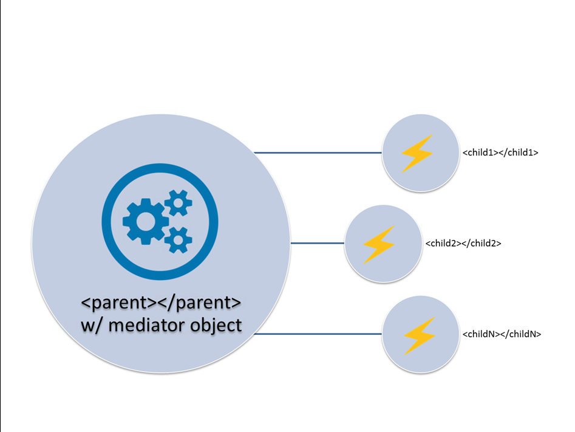

## What is Polymer?
[Polymer](https://www.polymer-project.org/1.0/) is a lean & light library from Google that pushes the next evolution of the web.
It adds elegance in building custom DOM/html elements, while providing less boilerplate code.
## Goals
Polymer has set out with some goals in mind.  The main goal is to enable to developers to create compelex apps and user interfaces
with an already familiar DOM as a framework.  A secondary goal is to promote the http/2 way of creating webapps with smart caching,
which is covered later in the tutorial.  There are other ad hoc goals, but they are aimed at encapsulating and creating tools to improve
efficiency in development, testing, and performance.  For example, using [polygit](https://github.com/PolymerLabs/polygit) and 
[bower](http://bower.io/) for managing elements, [polylint](https://github.com/PolymerLabs/polylint) 
for error management, and [polydev](https://github.com/PolymerLabs/polydev) to measure the efficiency of your elements.

## Thinking in Polymer
Polymer is unlike a lot of libraries becuase it is built on and extends the HTML + JavaScript standard for the web.  Sometimes, it can
become a cumbersome task to 'just making things work', which makes it easy to ignore the fact that this is 80% reusable custom HTML and
20% JavaScript for control and definitions.

It often helps in building a polymer application to 'think locally', meaning examine one element at a time in relation to it's sibling
and parent elements.  Another important mindset to have when working with Polymer is the 'composition' mindset.  The 'composition' mindset
allows you to think of how the elements really do represent building blocks in the context of the larger app.  In browsers that support
it, you can build in what's called the "shadowDOM" (see vocabulary below) to manipulate state and values which will be passed down
to the "localDOM".

The flow of data or passing of information from element to element is also required to create a robust Polymer webapp.  We call this
the "mediator pattern", but in some ways it reflects the functionality of the controller in MVC or
the dispatcher in Flux (React.js).  The general idea is reflected in the picture below.  Events that deal with
state information are passed from child to child via the mediator.

## Hello, world!

# organization / branches? in series

     - animation
     - data-binding
     - e-commerce
     - http-2
     - intro
     - polydev
     - polylint
     - psk
     - testing
     - web-components
     
# proposed series order 
     
     1. intro
     2. psk (Polymer Starter Kit)
     3. polylint (error linting)
     4. data-binding
     5. testing
     6. http-2
     7. e-commerce
     8. web-components